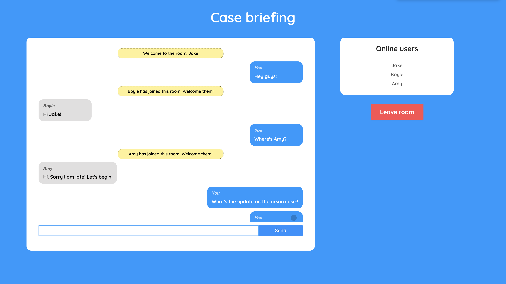

# Slingchat
A Realtime Chat application using **React** on the front end, with **NodeJS + Socket.io web socket library** on the back end.

You can gather your friends, create a room and start chatting right away.\
Access the slingchat app [here](https://sling-chat.netlify.app/).\
Enter your name and the room that you want to join to open the chat window.

For any issues or suggestions, feel free to contact me.\
[LinkedIN](https://www.linkedin.com/in/ragavendhar-t/)

Setup:
-run `npm i && npm start` for both client and server side to start the development server
